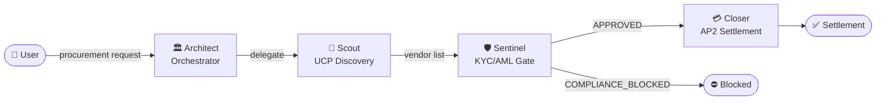

# Aura — Autonomous Reliable Agentic Commerce

> **Multi-agent B2B procurement with built-in KYC/AML compliance and verifiable payment.**

[](https://python.org)
[](https://github.com/google/adk-python)
[](https://cloud.google.com/vertex-ai)
[](https://kagent.dev)
[](LICENSE)

---

## What is Aura?

Aura automates the full B2B procurement lifecycle — from vendor discovery to payment settlement — using a squad of autonomous AI agents. Unlike traditional shopping bots, Aura integrates **Real-time KYC/AML compliance** and **cryptographically verifiable payment mandates** before any transaction is settled.

**Built for:** Google AI Agent Labs Oslo 2026 — Team 6

---

## The Agent Squad

| Agent | Role | Protocol |
| :--- | :--- | :--- |
| **Architect** | Root orchestrator — parses intent, manages pipeline | Google ADK `LlmAgent` |
| **Scout** | Discovers vendors via Universal Commerce Protocol | UCP `/.well-known/ucp` |
| **Sentinel** | KYC/AML compliance gate via Core Banking (BMS) | BMS Compliance API |
| **Closer** | Generates Intent Mandate and settles via AP2 | AP2 `IntentMandate` + ECDSA-P256 |



---

## Quick Start

### Prerequisites

- Python 3.12+
- Google Cloud project with Vertex AI enabled (`ai-agent-labs-oslo-26-team-6`)
- Application Default Credentials: `gcloud auth application-default login`

### Install & Run

```bash
# Clone and enter
git clone https://github.com/shailwx/aura && cd aura

# Set up virtualenv
python3 -m venv .venv && source .venv/bin/activate
pip install -r requirements.txt

# Configure environment
cp .env.example .env
# Edit .env if needed (project/region already pre-configured)

# Launch ADK dev UI — full browser-based agent playground
adk web

# Or run the FastAPI server directly
uvicorn main:app --reload --port 8080
```

### Try it

```bash
# Happy path — legitimate vendor
curl -X POST http://localhost:8080/run \
  -H "Content-Type: application/json" \
  -d '{"message": "Buy 3 Laptop Pro 15 units from the best vendor"}'

# Blocked path — triggers Sentinel compliance block
curl -X POST http://localhost:8080/run \
  -H "Content-Type: application/json" \
  -d '{"message": "Buy laptops from ShadowHardware"}'
```

See [API Reference](docs/API_REFERENCE.md) for full endpoint documentation.

### Streamlit Dashboard

```bash
streamlit run ui/dashboard.py
```

Opens at `http://localhost:8501`. Runs the full pipeline visually with real-time agent status cards, vendor tables, compliance badges, and settlement results. Works in **demo mode** (no GCP credentials needed) or **API mode** (calls the FastAPI server). See [Dashboard Guide](docs/DASHBOARD.md) for details.

### Run Tests

```bash
pytest tests/ -v
```

See [Testing Guide](docs/TESTING.md) for full test suite documentation.

---

## Project Structure

```
aura/
├── main.py               # FastAPI app + ADK Runner
├── agents/
│   ├── architect.py      # Root orchestrator (SequentialAgent wiring)
│   ├── scout.py          # UCP vendor discovery
│   ├── sentinel.py       # KYC/AML compliance gate
│   └── closer.py         # AP2 payment settlement
├── tools/
│   ├── ucp_tools.py      # Universal Commerce Protocol mock
│   ├── compliance_tools.py  # BMS KYC/AML compliance mock
│   └── ap2_tools.py      # Agent Payments Protocol v2 mock
├── docs/
│   ├── ARCHITECTURE.md   # System architecture diagram
│   ├── AGENT_FLOW.md     # Sequence diagrams (happy + blocked path)
│   ├── DATA_MODEL.md     # Data model class diagram
│   ├── DEPLOYMENT.md     # Kagent deployment guide
│   └── PROTOCOLS.md      # UCP + AP2 protocol design rationale
├── tests/
│   ├── test_compliance_tool.py
│   └── test_flow.py
├── Dockerfile            # Multi-stage production container
├── kagent.yaml           # Kagent v1alpha2 CRD manifests
├── AURA_PRD.md           # Product Requirements Document
└── requirements.txt
```

---

## Documentation

### For Business Users

| Document | Description |
| :--- | :--- |
| [Business Guide](docs/BUSINESS_GUIDE.md) | What Aura does, business value, use cases, glossary — no code |
| [Demo Script](docs/DEMO_SCRIPT.md) | Hackathon pitch guide, live demo steps, and judge Q&A prep |
| [PRD](AURA_PRD.md) | Full Product Requirements Document |

### For Technical Users

| Document | Description |
| :--- | :--- |
| [Technical Guide](docs/TECHNICAL_GUIDE.md) | Setup, agent internals, tool layer, extending Aura, production checklist |
| [Architecture](docs/ARCHITECTURE.md) | System topology and component diagram |
| [Agent Flow](docs/AGENT_FLOW.md) | Sequence diagrams for happy path and compliance block |
| [Data Model](docs/DATA_MODEL.md) | VendorEndpoint, IntentMandate, ComplianceResult schemas |
| [API Reference](docs/API_REFERENCE.md) | REST endpoints — `/run`, `/run/stream`, `/health` |
| [Dashboard](docs/DASHBOARD.md) | Streamlit UI guide (demo & API modes) |
| [Testing](docs/TESTING.md) | Test suite coverage and how to run tests |
| [Deployment](docs/DEPLOYMENT.md) | Kagent Kubernetes deployment guide |
| [Protocols](docs/PROTOCOLS.md) | UCP, AP2, and BMS protocol design rationale |

---

## GCP Configuration

| Setting | Value |
| :--- | :--- |
| Project | `ai-agent-labs-oslo-26-team-6` |
| Region | `europe-north1` |
| Model | `gemini-2.0-flash` via Vertex AI |

---

## License

Apache 2.0 — see [LICENSE](LICENSE).
