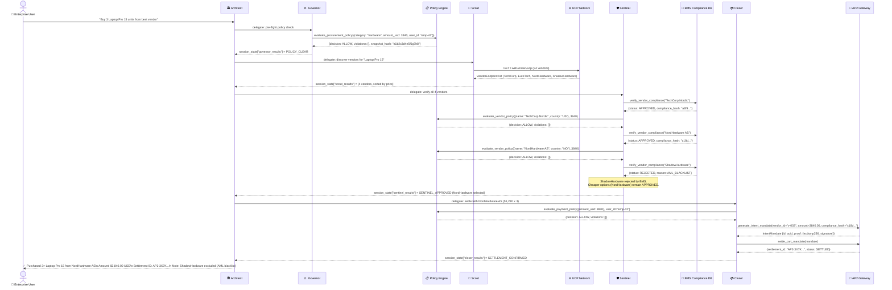
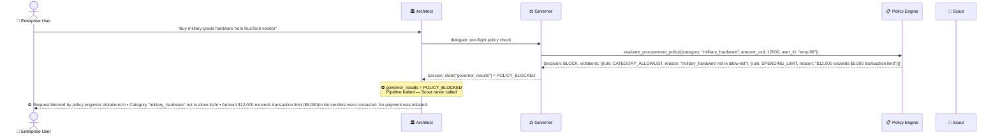
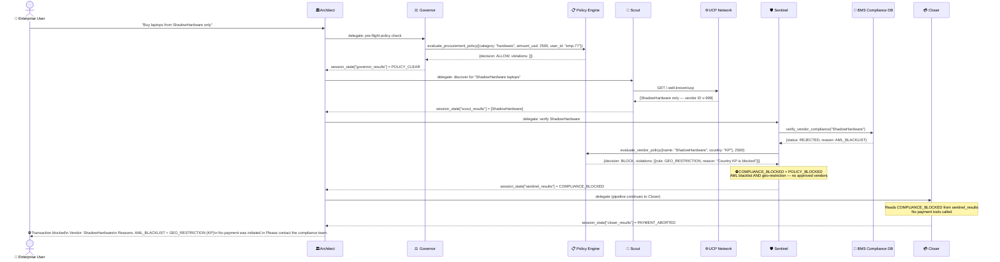

# Aura — Agent Flow Diagrams

## Overview

This document shows the detailed message flow through the Aura multi-agent pipeline for three key scenarios:

1. **Happy Path** — request clears all policy gates, vendor approved, payment settled
2. **Policy Block** — Governor halts the pipeline at the pre-flight stage (geo-restriction)
3. **Compliance Block** — Sentinel detects AML blacklist, Closer aborts payment

The pipeline runs in strict sequence: **Governor → Scout → Sentinel → Closer**.  
The Governor is the pre-flight gate added by the Policy Engine feature (issue #15).

---

## Scenario 1 — Happy Path (Policy Clear → Settlement)

---

## Scenario 2 — Policy Block (Governor halts at pre-flight)

---

## Scenario 3 — Compliance Block (Sentinel → Closer aborts)

---

## Session State Handoff

ADK passes data between agents via `session_state`. Here is the key state written at each step:

| Agent | Key Written | Possible Values |
| :--- | :--- | :--- |
| Governor | `governor_results` | `POLICY_CLEAR` / `POLICY_WARNINGS` / `POLICY_REVIEW_REQUIRED` / `POLICY_BLOCKED` |
| Scout | `scout_results` | List of `VendorEndpoint` dicts, sorted by price |
| Sentinel | `sentinel_results` | `SENTINEL_APPROVED` / `COMPLIANCE_BLOCKED` / `POLICY_BLOCKED` / `SENTINEL_REVIEW_REQUIRED` |
| Closer | `closer_results` | `SETTLEMENT_CONFIRMED` / `PAYMENT_PENDING_REVIEW` / `PAYMENT_ABORTED` |

## Pipeline Rules

- The Architect always runs all four agents in sequence (Governor → Scout → Sentinel → Closer).
- **Closer** checks `governor_results` and `sentinel_results` before calling any payment tool. If either contains `POLICY_BLOCKED` or `COMPLIANCE_BLOCKED`, it outputs `PAYMENT_ABORTED` immediately.
- Blocking at the Governor stage does not prevent Scout/Sentinel from running (ADK `SequentialAgent` executes all sub-agents), but Closer will still abort the payment.
- Policy rules are stored in `tmp/policies.json` and managed via the `/policies` REST API (`X-Admin-Token` required for mutations).
