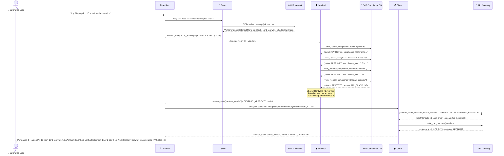
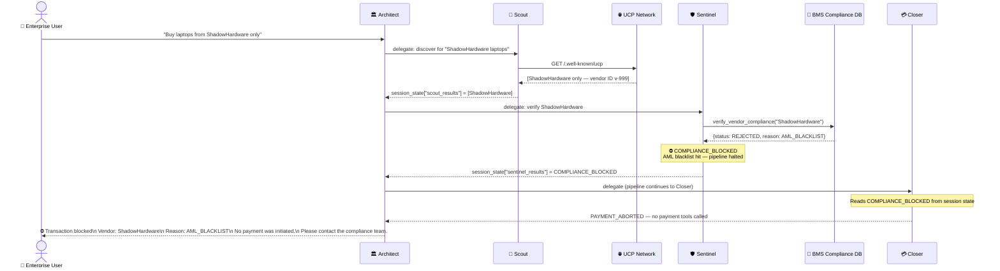

# Aura — Agent Flow Diagrams

## Overview

This document shows the detailed message flow through the Aura multi-agent pipeline for two key scenarios:
1. **Happy Path** — legitimate vendor, compliance approved, payment settled
2. **Blocked Path** — blacklisted vendor detected, pipeline halted before payment

---

## Happy Path — Successful Procurement

---

## Blocked Path — Full Compliance Block

---

## Session State Handoff

ADK passes data between agents via `session_state`. Here is the key state written at each step:

| Agent | Key Written | Value |
| :--- | :--- | :--- |
| Scout | `scout_results` | List of `VendorEndpoint` dicts |
| Sentinel | `sentinel_results` | Compliance summary (approved list + rejected list) |
| Closer | `closer_results` | Settlement result or PAYMENT_ABORTED |
