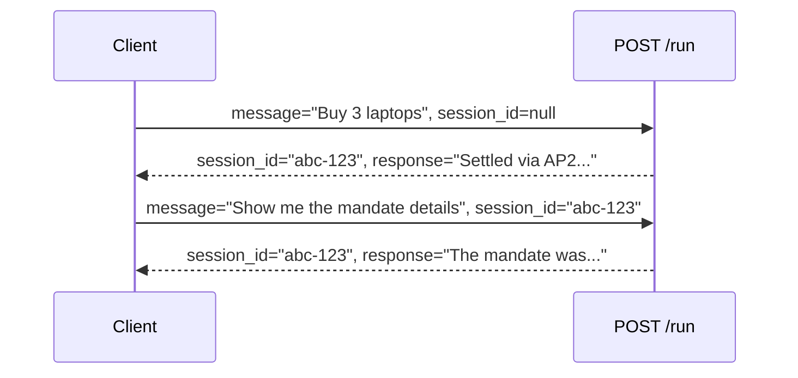

# Aura — REST API Reference

## Overview

The Aura FastAPI server (`main.py`) exposes three HTTP endpoints. It is served by Uvicorn on port `8080` and communicates with the Google ADK Runner to execute the multi-agent procurement pipeline.

**Base URL (local dev):** `http://localhost:8080`  
**Interactive docs (when running):** `http://localhost:8080/docs` (Swagger UI), `http://localhost:8080/redoc`

---

## Endpoints

### GET /health

Liveness probe for Kubernetes and load balancers.

**Request:** No parameters.

**Response `200 OK`:**

```json
{
  "status": "ok",
  "service": "aura"
}
```

**Example:**

```bash
curl http://localhost:8080/health
```

---

### POST /run

Submit a natural language procurement request and receive the complete agent response once the full pipeline has finished.

**Request body (`application/json`):**

| Field | Type | Required | Description |
| :--- | :--- | :--- | :--- |
| `message` | `string` | ✅ | Natural language procurement intent (e.g. `"Buy 3 Laptop Pro 15 units"`) |
| `user_id` | `string` | ❌ | Caller identity. Defaults to `"default-user"` |
| `session_id` | `string` | ❌ | ADK session ID. Auto-generated UUID if omitted. Pass the same value to continue a conversation |

**Response `200 OK`:**

| Field | Type | Description |
| :--- | :--- | :--- |
| `session_id` | `string` | The ADK session ID (useful for follow-up requests) |
| `response` | `string` | Full text response from the Architect agent after pipeline completes |

**Response `500 Internal Server Error`:**

```json
{ "detail": "Agent produced no response." }
```

**Examples:**

```bash
# Happy path — best vendor selected, payment settled
curl -X POST http://localhost:8080/run \
  -H "Content-Type: application/json" \
  -d '{
    "message": "Buy 3 Laptop Pro 15 units from the best available vendor",
    "user_id": "enterprise-buyer-1"
  }'
```

```json
{
  "session_id": "f47ac10b-58cc-4372-a567-0e02b2c3d479",
  "response": "✅ Purchased 3× Laptop Pro 15 from NordHardware AS\n   Amount: $3,840.00 USD\n   Settlement ID: AP2-3X7K9F2A1B4C\n   Note: ShadowHardware excluded (AML blacklist)"
}
```

```bash
# Continue the same session with a follow-up
curl -X POST http://localhost:8080/run \
  -H "Content-Type: application/json" \
  -d '{
    "message": "What was the settlement ID again?",
    "user_id": "enterprise-buyer-1",
    "session_id": "f47ac10b-58cc-4372-a567-0e02b2c3d479"
  }'
```

```bash
# Blocked path — triggers Sentinel compliance block
curl -X POST http://localhost:8080/run \
  -H "Content-Type: application/json" \
  -d '{"message": "Buy laptops from ShadowHardware"}'
```

```json
{
  "session_id": "a2b3c4d5-...",
  "response": "⛔ Transaction blocked\n   Vendor: ShadowHardware\n   Reason: AML_BLACKLIST\n   No payment was initiated. Please contact the compliance team."
}
```

---

### POST /run/stream

Same as `/run` but streams the agent response as it is generated, token by token. Compatible with Server-Sent Events (SSE).

**Request body:** Identical to `POST /run`.

**Response:** `text/plain` streaming body. Each chunk is a text fragment from the agent response.

**Example with `curl` (streaming):**

```bash
curl -X POST http://localhost:8080/run/stream \
  -H "Content-Type: application/json" \
  -d '{"message": "Buy 5 Laptop Pro 15 units from best vendor"}' \
  --no-buffer
```

**Example with Python `httpx`:**

```python
import httpx

async with httpx.AsyncClient() as client:
    async with client.stream(
        "POST",
        "http://localhost:8080/run/stream",
        json={"message": "Buy 3 laptops"},
        timeout=120,
    ) as response:
        async for chunk in response.aiter_text():
            print(chunk, end="", flush=True)
```

---

## Session Continuity

The `/run` and `/run/stream` endpoints support multi-turn conversations. Pass the `session_id` returned by a previous call to continue the context:



---

## Error Codes

| HTTP Status | Condition |
| :--- | :--- |
| `200 OK` | Pipeline completed (whether settled or compliance-blocked — both are valid outcomes) |
| `500 Internal Server Error` | Agent produced no output (framework error) |

---

## Running the Server

```bash
# Development (auto-reload)
uvicorn main:app --reload --port 8080

# Production (as in Docker)
uvicorn main:app --host 0.0.0.0 --port 8080 --workers 4

# ADK dev UI (browser-based playground)
adk web
```
