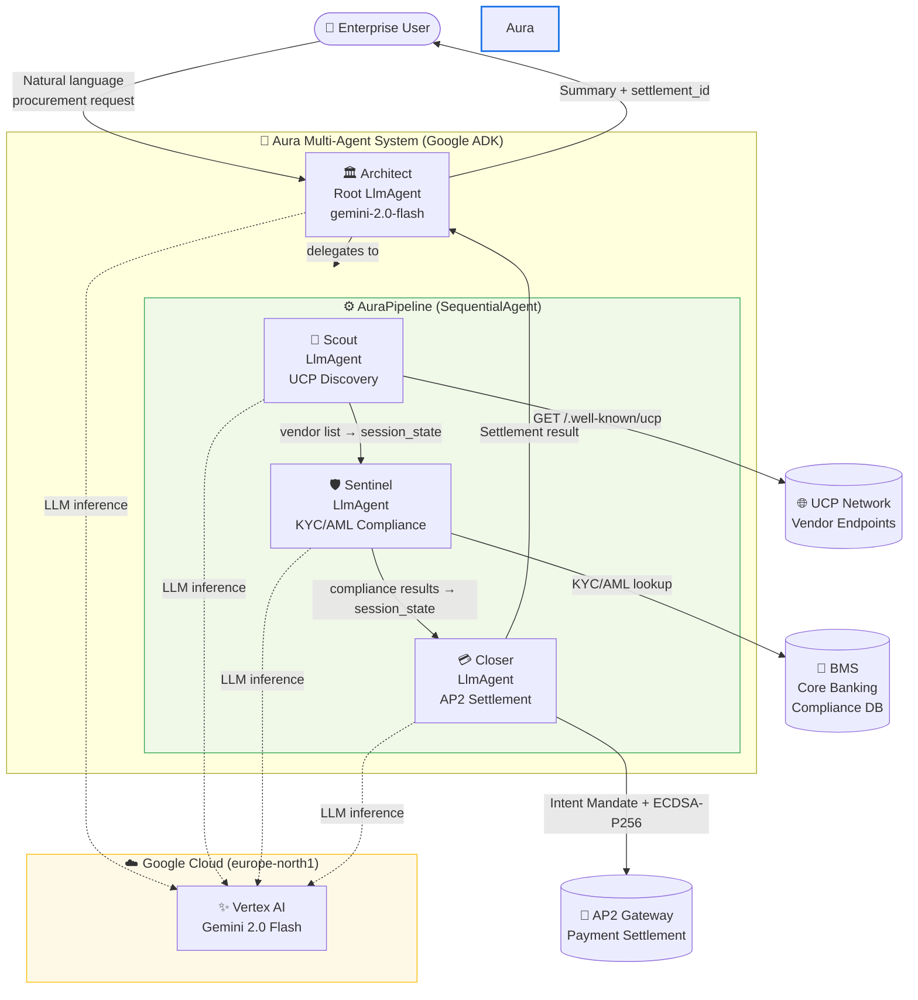

# Aura — System Architecture

## Overview

Aura is a Multi-Agent System (MAS) built on Google ADK. The Architect orchestrates three specialist sub-agents — Scout, Sentinel, and Closer — in a sequential pipeline. Each agent has a single responsibility and communicates via ADK session state.

---

## System Architecture Diagram



---

## Component Responsibilities

| Component | Type | Responsibility |
| :--- | :--- | :--- |
| **Architect** | `LlmAgent` (root) | Parses user intent, owns the pipeline, summarises outcome |
| **AuraPipeline** | `SequentialAgent` | Chains Scout → Sentinel → Closer in order |
| **Scout** | `LlmAgent` | Calls `discover_vendors()`, writes vendor list to session state |
| **Sentinel** | `LlmAgent` | Calls `verify_vendor_compliance()` for every vendor; blocks on REJECTED |
| **Closer** | `LlmAgent` | Calls `generate_intent_mandate()` + `settle_cart_mandate()`; no-ops if blocked |

---

## Data Flow

```
User message
    ↓
Architect (parse intent)
    ↓
Scout → session_state["scout_results"] = [VendorEndpoint, ...]
    ↓
Sentinel → session_state["sentinel_results"] = {approved: [...], rejected: [...]}
    ↓ (only if no rejections)
Closer → session_state["closer_results"] = {settlement_id, status, amount}
    ↓
Architect (summarise)
    ↓
User response
```

---

## Compliance Block Flow

If any vendor fails the Sentinel's KYC/AML check:

```
Sentinel detects REJECTED vendor
    ↓
Outputs COMPLIANCE_BLOCKED to session state
    ↓
Closer reads COMPLIANCE_BLOCKED → outputs PAYMENT_ABORTED
    ↓
Architect reports blocked transaction to user
    ↓
No payment tools are ever called
```

---

## Technology Stack

| Layer | Technology |
| :--- | :--- |
| Agent Framework | Google ADK (`google-adk`) |
| LLM | Gemini 2.0 Flash via Vertex AI |
| API Server | FastAPI + Uvicorn |
| Container | Docker (multi-stage, python:3.12-slim) |
| Orchestration | Kagent `kagent.dev/v1alpha2` |
| Cloud | GCP `europe-north1` |
| Protocols | UCP (mocked), AP2 (mocked), BMS (mocked) |
