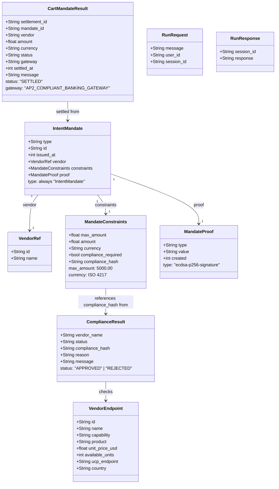

# Aura — Data Models

## Overview

These are the core data structures flowing through the Aura pipeline. They represent the canonical objects passed between agents via ADK session state and tool return values.

---

## Class Diagram



---

## JSON Examples

### VendorEndpoint

```json
{
  "id": "v-001",
  "name": "TechCorp Nordic",
  "capability": "dev.ucp.shopping",
  "product": "Laptop Pro 15",
  "unit_price_usd": 1299.00,
  "available_units": 50,
  "ucp_endpoint": "https://techcorp-nordic.example/.well-known/ucp",
  "country": "NO"
}
```

### ComplianceResult (Approved)

```json
{
  "vendor_name": "TechCorp Nordic",
  "status": "APPROVED",
  "compliance_hash": "a3f9c2e4b1d7f8a2c9e3b5d1f7a4c8e2b6d9f3a7c1e5b8d4f2a6c0e9b3d7f1a5",
  "message": "Vendor 'TechCorp Nordic' passed KYC/AML checks."
}
```

### ComplianceResult (Rejected)

```json
{
  "vendor_name": "ShadowHardware",
  "status": "REJECTED",
  "reason": "AML_BLACKLIST",
  "message": "Vendor 'ShadowHardware' is on the AML blacklist. Transaction blocked."
}
```

### IntentMandate

```json
{
  "type": "IntentMandate",
  "id": "f47ac10b-58cc-4372-a567-0e02b2c3d479",
  "issued_at": 1741694400,
  "vendor": {
    "id": "v-001",
    "name": "TechCorp Nordic"
  },
  "constraints": {
    "max_amount": 5000.00,
    "amount": 3897.00,
    "currency": "USD",
    "compliance_required": true,
    "compliance_hash": "a3f9c2e4b1d7f8a2c9e3b5d1f7a4c8e2b6d9f3a7c1e5b8d4f2a6c0e9b3d7f1a5"
  },
  "proof": {
    "type": "ecdsa-p256-signature",
    "value": "3A9F2C1E4B8D7F0A5C2E8B4D1F6A3C9E7B5D2F8A1C4E0B7D5F3A8C2E6B9D4F1A",
    "created": 1741694400
  }
}
```

### CartMandateResult

```json
{
  "settlement_id": "AP2-3X7K9F2A1B4C",
  "mandate_id": "f47ac10b-58cc-4372-a567-0e02b2c3d479",
  "vendor": "TechCorp Nordic",
  "amount": 3897.00,
  "currency": "USD",
  "status": "SETTLED",
  "gateway": "AP2_COMPLIANT_BANKING_GATEWAY",
  "settled_at": 1741694405,
  "message": "Payment of 3897.0 USD to TechCorp Nordic settled successfully via AP2."
}
```
