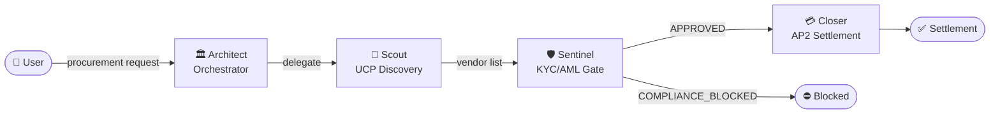

# 📚 AURA Documentation

> Complete reference library for the **A**utonomous **U**nified **R**eliable **A**gentic commerce system.

---

## 📋 At a Glance

| Property | Value |
|----------|-------|
| **Project** | AURA — Autonomous B2B Procurement Agent |
| **Framework** | Google ADK + Gemini 3.1 Flash |
| **Updated** | 2026-03-11 |
| **Status** | Production-ready |

---

## For Business Users

| Document | Description |
|----------|-------------|
| [BUSINESS_GUIDE.md](BUSINESS_GUIDE.md) | What AURA does, key benefits, and ROI explainer for non-technical stakeholders |
| [USE_CASES.md](USE_CASES.md) | 16 procurement scenarios — core demos, SSA contract types, and extended real-world flows |
| [DEMO_SCRIPT.md](DEMO_SCRIPT.md) | End-to-end demo walkthrough with talking points and sample outputs |
| [DASHBOARD.md](DASHBOARD.md) | How to use the Streamlit monitoring dashboard |

---

## For Technical Users

| Document | Description |
|----------|-------------|
| [ARCHITECTURE.md](ARCHITECTURE.md) | System design, agent topology, and component relationships |
| [AGENT_FLOW.md](AGENT_FLOW.md) | Sequence diagrams for happy-path and compliance-blocked flows |
| [DATA_MODEL.md](DATA_MODEL.md) | UCP vendor records, AP2 Intent Mandates, and compliance report schemas |
| [PROTOCOLS.md](PROTOCOLS.md) | UCP and AP2 protocol specifications |
| [API_REFERENCE.md](API_REFERENCE.md) | REST API endpoints, request/response schemas, and curl examples |
| [TECHNICAL_GUIDE.md](TECHNICAL_GUIDE.md) | Local setup, environment variables, agent internals, and production checklist |
| [TESTING.md](TESTING.md) | Test suite layout, how to run tests, and coverage guide |
| [DEPLOYMENT.md](DEPLOYMENT.md) | Docker, Kagent (Kubernetes), and GCP Cloud Run deployment instructions |

---

## Agent Flow at a Glance

---

## Where to Start

- **Business stakeholder?** → Start with [BUSINESS_GUIDE.md](BUSINESS_GUIDE.md)
- **Running a demo?** → Open [DEMO_SCRIPT.md](DEMO_SCRIPT.md)
- **Setting up locally?** → Follow [TECHNICAL_GUIDE.md](TECHNICAL_GUIDE.md)
- **Deploying to production?** → See [DEPLOYMENT.md](DEPLOYMENT.md)
- **Integrating via API?** → Check [API_REFERENCE.md](API_REFERENCE.md)
